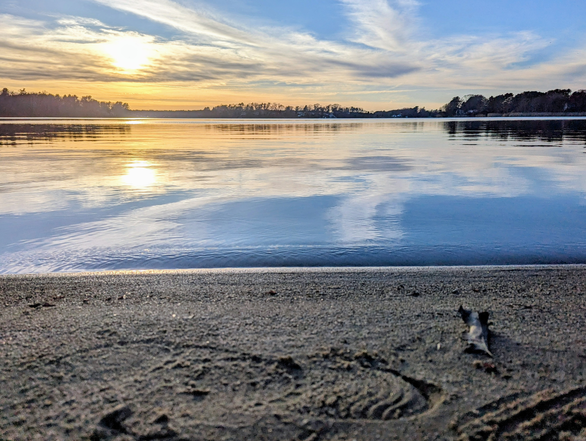

# Old Colony Anglers — Website Admin Guide

This guide explains how to maintain and update the club website. No coding experience required — everything is plain HTML that you edit like a text document. Use any text editor (Notepad, VS Code, etc.).

---

## TODO — Placeholder Data

Everything in this list needs real content before the site is ready to share publicly.

### Site-wide
- [ ] **Club logo** — waiting on graphic designer. Swap into all 7 pages when received (see One-Time Setup below)
- [ ] **Facebook URL** — replace `PASTE_FACEBOOK_URL` in the footer of all 7 pages
- [ ] **Instagram URL** — replace `PASTE_INSTAGRAM_URL` in the footer of all 7 pages
- [ ] **Merch tab** — hidden until merchandise is ready. See "Enabling the Merch Tab" below to turn it on.
- [ ] **Membership details** — fill in Annual Dues, Initiation Fee, How to Apply, and Meetings in the table on `about.html`

### Waters — East Monponsett
- [ ] **Verify acreage** (~239 acres) against the MA DFW lake survey PDF
- [ ] **Verify max depth** (~16 ft) against the MA DFW lake survey PDF
- [ ] **Google Maps link** — replace `PASTE_GOOGLE_MAPS_URL_HERE` in `waters.html`
- [ ] **Lake map image** — download from MA DFW or Navionics, save to `images/waters/east-monponsett-map.jpg`, uncomment the `` line

### Waters — West Monponsett
- [ ] **Max Depth** — blank field in the info table
- [ ] **Access** — blank field in the info table
- [ ] **Parking** — blank field in the info table
- [ ] **Boat Launch** — blank field in the info table
- [ ] **Notes** — placeholder text, needs real fishing notes
- [ ] **Google Maps link** — replace `PASTE_GOOGLE_MAPS_URL_HERE` in `waters.html`
- [ ] **Lake map image** — save to `images/waters/west-monponsett-map.jpg`, uncomment the `` line

### Gallery
- [ ] **April 2026 outing** — add description and photos (`images/gallery/`)

---

## Enabling the Merch Tab

The Merch tab is hidden in the navigation on all pages. When you're ready to launch merchandise:

1. Open **every** `.html` file (all 7: `index.html`, `waters.html`, `gallery.html`, `about.html`, `quickstart.html`, `licenses.html`, `merch.html`)
2. In each file, find this commented-out line in the `<nav>` block:
   ```html
   <!-- <a href="merch.html">Merch</a> -->
   ```
3. Remove the `<!--` at the start and `-->` at the end so it reads:
   ```html
   <a href="merch.html">Merch</a>
   ```

The tab will appear in the navigation on every page. Make sure `merch.html` has real content before you do this.

---

## One-Time Setup

Complete these steps once when you first receive your assets from the designer.

### Adding Your Logo

When you receive your logo from the graphic designer:

1. Save the file as `images/logo.png` (PNG with transparent background works best)
2. Open **every** `.html` file
3. Find this line and delete it:
   ```html
   <div class="site-logo-placeholder" aria-hidden="true"></div>
   ```
4. Uncomment the line above it:
   ```html
   
   ```

The logo will appear as a circle in the header on every page. The CSS already handles the circular crop.

> **Favicon bonus:** The favicon (browser tab icon) is already wired up on every page pointing to `images/logo.png`. Once you drop the logo file in, it will appear in the tab automatically — no extra steps needed.

### Adding the Hero Pond Photo

When you have your pond photo:

1. Save the file as `images/hero-pond.jpg`
2. Open **every** `.html` file
3. Find this line and delete it:
   ```html
   <div class="hero-placeholder">Pond photo coming soon</div>
   ```
4. Uncomment the line above it:
   ```html
   
   ```

The photo will display as a full-width banner between the header and navigation on every page. Landscape orientation works best. The CSS crops it to 220px tall and centers it.

---

## Folder Structure

```
OCA_Website/
│
├── index.html          ← Home page and news feed
├── waters.html         ← Club fishing waters (one section per water)
├── gallery.html        ← Photo gallery (one section per outing)
├── about.html          ← Club history and officer list
├── quickstart.html     ← Beginner's fishing guide
├── licenses.html       ← MA fishing license information
├── merch.html          ← Club merchandise (placeholder)
│
├── css/
│   └── style.css       ← ALL colors and styles — one file controls the whole site
│
└── images/
    ├── gallery/        ← Drop outing photos here (referenced in gallery.html)
    └── waters/         ← Drop lake map images here (referenced in waters.html)
```

---

## Changing the Site Colors

Open `css/style.css`. The very first section looks like this:

```css
:root {
  --color-primary:    #9B2335;  /* cranberry red — main brand color */
  --color-primary-dk: #6e1826;  /* darker red — used for hover states */
  ...
}
```

Change any hex color value (e.g. `#9B2335`) and save. That color updates everywhere on the site instantly. You do not need to touch any HTML file.

---

## Adding a News Item (Home Page)

Open `index.html`. Find the `<!-- Latest News -->` section. Copy one `<li>` block and paste it above the `<!-- COPY FROM HERE` comment. Fill in the date and text. Newest items go at the top.

**Copy this:**
```html
<li>
  <span class="news-date">Month Year</span>
  Your news item here.
</li>
```

---

## Adding a New Water

### Step 1 — Get the depth map image from MA DFW

MA DFW publishes free bathymetric (depth) maps for most MA ponds as single-page PDFs.

1. Search for your pond at [mass.gov](https://www.mass.gov) — e.g. search "East Monponsett Pond DFW"
   - East Monponsett PDF: `https://www.mass.gov/doc/east-monponsett-pond/download`
2. Go to **ilovepdf.com** → "PDF to JPG" (free, no account needed)
3. Upload the PDF and download the JPG
4. Save it to `images/waters/` using a clear name, like `east-monponsett-map.jpg`
5. In `waters.html`, find the pond's `<div class="water-map">` block:
   - Delete the `<div class="water-map-placeholder">Lake map coming soon</div>` line
   - Uncomment the `<!--  -->` line above it and update the filename

If you can't find a DFW PDF, you can also use a screenshot from Navionics Web App or save any other lake map image to the same folder.

### Step 2 — Get a Google Maps link

1. Go to [maps.google.com](https://maps.google.com)
2. Search for the water
3. Click **Share** → **Copy link**
4. Paste that URL into the waters entry (see below)

*Optional — embedded map:*
Click **Share** → **Embed a map** → copy the `<iframe>` code. You can paste this instead of (or in addition to) the link.

### Step 3 — Add the water section to `waters.html`

Open `waters.html`. Find the comment that says `<!-- COPY FROM HERE`. Copy the template block below it and paste it **in alphabetical order** among the existing water sections.

Fill in each field:

```html
<section class="water-section" id="quabbin-reservoir">

  <h2>Quabbin Reservoir</h2>

  <div class="water-layout">
    <div class="water-info">
      <table>
        <tbody>
          <tr><th>Town</th><td>Belchertown / Ware</td></tr>
          <tr><th>Acres</th><td>39 square miles</td></tr>
          <tr><th>Max Depth</th><td>~150 ft</td></tr>
          <tr><th>Species</th><td>Lake Trout, Smallmouth Bass, Yellow Perch</td></tr>
          <tr><th>Stocked</th><td>Yes — Lake Trout by MA DFW</td></tr>
          <tr><th>Special Regs</th><td>Fly fishing only in some areas — check MA regs</td></tr>
          <tr><th>Access</th><td>Members only — Gate 8</td></tr>
          <tr><th>Parking</th><td>Gravel lot at the gate</td></tr>
          <tr><th>Boat Launch</th><td>No motorized boats</td></tr>
        </tbody>
      </table>
    </div>
    <div class="water-map">
      
    </div>
  </div>

  <div class="water-google-maps">
    <a href="https://maps.google.com/YOUR_LINK_HERE" target="_blank" rel="noopener">→ View on Google Maps</a>
  </div>

  <p class="water-notes">
    <strong>Notes:</strong> Your notes about this water.
  </p>

</section>
<hr>
```

> **The `id=` value** (e.g. `id="quabbin-reservoir"`) must be lowercase with hyphens instead of spaces. No special characters. This is what the TOC links use.
>
> **The `data-towns` attribute** lists every town the water touches (comma-separated). The **Town** row in the table should show where parking/access is. The `data-towns` attribute is what tells you which town groups to add the water to in the TOC — check it before updating the jump links.
> Example: `<section class="water-section" id="west-monponsett" data-towns="Halifax, Hanson">`

### Step 4 — Add a link to the TOC

At the top of `waters.html`, find the `<nav class="toc">` block. Waters are grouped by town — each town is a `<details>` block that expands when clicked.

- **If the town already exists**, find its `<details>` block and add a link **in alphabetical order** inside the `<div class="toc-town-waters">`:

```html
<a href="#quabbin-reservoir">Quabbin Reservoir</a>
```

- **If it's a new town**, copy an entire `<details>` block, update the town name and link, and insert it **alphabetically** among the existing towns.

- **If the water spans two towns**, add a link under each town's `<details>` block.

---

## Adding a Gallery Outing

### Step 1 — Save your photos

Save all outing photos to the `images/gallery/` folder.
Use descriptive names, e.g. `june2026-quabbin-01.jpg`, `june2026-quabbin-02.jpg`.

### Step 2 — Add the outing section to `gallery.html`

Open `gallery.html`. Find the comment that says `<!-- COPY FROM HERE`. Copy the template block and paste it **above** the previous outing (newest outing goes first).

Fill in the heading and add one `` line per photo:

```html
<section class="outing" id="outing-june-2026">

  <h2>June 2026 — Quabbin Reservoir</h2>

  <p class="outing-description">
    Brief description of the outing (optional — delete this paragraph if not needed).
  </p>

  <div class="gallery">
    
    
  </div>

</section>
<hr>
```

> **The `id=` value** must be lowercase with hyphens, e.g. `id="outing-june-2026"`.

### Step 3 — Add a link to the TOC

At the top of `gallery.html`, find the `<nav class="toc">` block. Outings are grouped by year using expandable `<details>` blocks.

- **If the year already exists**, find its `<details>` block and add a link at the **top** of the `<div class="toc-town-waters">` (newest first):

```html
<a href="#outing-june-2026">June 2026 — Quabbin Reservoir</a>
```

- **If it's a new year**, copy an entire `<details>` block, update the year in the `<summary>`, and place it above the previous year's block.

---

## Updating Club Officers

Open `about.html`. Find the officers table. Edit the text inside each `<td>` cell.

To add a new officer row, copy one `<tr>` block:

```html
<tr>
  <td>Sergeant at Arms</td>
  <td>Jane Smith</td>
  <td><a href="mailto:jane@example.com">jane@example.com</a></td>
</tr>
```

Paste it inside the `<tbody>` section, above the `<!-- COPY FROM HERE` comment.

---

## Adding a New Page

1. **Copy an existing page** (e.g. copy `merch.html`, rename it to `newpage.html`)
2. **Update the `<title>`** tag at the top
3. **Update the `<h1>`** heading inside `<main>`
4. **Add your content** inside the `<div class="container">` block
5. **Update the nav in every page** — open each `.html` file and add your new link inside the `<nav>` block:
   ```html
   <a href="newpage.html">New Page</a>
   ```
   Files to update: `index.html`, `waters.html`, `gallery.html`, `about.html`, `quickstart.html`, `licenses.html`, `merch.html`, and your new page itself.
6. **Mark the active page** — in your new page's nav, add `class="active"` to its own link:
   ```html
   <a href="newpage.html" class="active">New Page</a>
   ```

---

## Deploying to GitHub Pages

### First time setup

1. Push the folder to a GitHub repository
2. Go to the repository on GitHub
3. Click **Settings** → **Pages** (left sidebar)
4. Under **Source**, select `Deploy from a branch`
5. Choose branch: `main`, folder: `/ (root)`
6. Click **Save**
7. Your site will be live at `https://YOUR-USERNAME.github.io/YOUR-REPO-NAME/`

### Publishing updates

After editing any file:

```
git add .
git commit -m "Brief description of what you changed"
git push
```

GitHub Pages automatically rebuilds the site within about a minute.

---

## Updating Fishing Regulations Each Year

MassWildlife publishes a new regulation summary each January or February.
Do this once per year to keep the MA Regs page current:

1. Go to [mass.gov/masswildlife](https://www.mass.gov/masswildlife) and download the current **Freshwater Fishing Regulation Summary** PDF
2. Feed the PDF to an AI (Claude, ChatGPT, etc.) with this prompt:
   > "Extract all freshwater fishing species from this PDF into a list with these columns:
   > Species, Open Season, Minimum Size, Daily Bag Limit, Notes.
   > Include every species listed."
3. Open `regulations.html` and find the `<tbody>` inside the regulations table
4. Update each `<td>` cell with the new values — one row per species, keeping rows in alphabetical order
5. Update the season year in the `<h2>` near the top (e.g. change `2026 Season` to `2027 Season`)
6. Update the `Last updated` line just below it

---

## Quick Reference

| Task | File to edit |
|---|---|
| Add news item | `index.html` |
| Add a water | `waters.html` + add image to `images/waters/` |
| Add gallery outing | `gallery.html` + add images to `images/gallery/` |
| Update contacts | `about.html` |
| Update regulations | `regulations.html` (see "Updating Fishing Regulations" above) |
| Change colors | `css/style.css` (top of file, `:root` block) |
| Update license info | `licenses.html` |
| Update getting started guide | `quickstart.html` |
